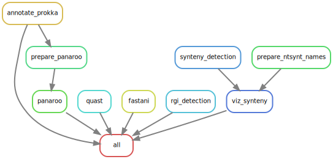

# snakemake-assembly-postprocessing

[](https://snakemake.github.io)
[](https://github.com/MPUSP/snakemake-assembly-postprocessing/actions/workflows/snakemake-tests.yml)
[](https://docs.conda.io/en/latest/)
[](https://apptainer.org/)
[](https://snakemake.github.io/snakemake-workflow-catalog/docs/workflows/MPUSP/snakemake-assembly-postprocessing)

A Snakemake workflow for the post-processing of microbial genome assemblies.

- [snakemake-assembly-postprocessing](#snakemake-assembly-postprocessing)
  - [Usage](#usage)
  - [Workflow overview](#workflow-overview)
  - [Installation](#installation)
  - [Deployment options](#deployment-options)
  - [Authors](#authors)
  - [References](#references)

## Usage

The usage of this workflow is described in the [Snakemake Workflow Catalog](https://snakemake.github.io/snakemake-workflow-catalog/docs/workflows/MPUSP/snakemake-assembly-postprocessing).

Detailed information about input data and workflow configuration can also be found in the [`config/README.md`](config/README.md).

If you use this workflow in a paper, don't forget to give credits to the authors by citing the URL of this repository.

_Workflow overview:_



## Workflow overview

1. Parse `samples.csv` table containing the samples's meta data (`python`)
2. Annotate assemblies using one of the following tools:
   1. NCBI's Prokaryotic Genome Annotation Pipeline ([PGAP](https://github.com/ncbi/pgap)). Note: needs to be installed manually
   2. [prokka](https://github.com/tseemann/prokka), a fast and light-weight prokaryotic annotation tool
   3. [bakta](https://github.com/oschwengers/bakta), a fast, alignment-free annotation tool. Note: Bakta will automatically download its companion database from zenodo (light: 1.5 GB, full: 40 GB)
3. Predict antimicrobial resistance (AMR) genes using [RGI](https://github.com/arpcard/rgi)
4. Create a QC report for the assemblies using [Quast](https://github.com/ablab/quast)
5. Create a pangenome analysis (orthologs/homologs) using [Panaroo](https://gthlab.au/panaroo/)
6. Compute pairwise average nucleotide identity (ANI) between the assemblies using [FastANI](https://github.com/ParBLiSS/FastANI) and plot a phylogenetic tree based on the ANI distances.

## Installation

**Step 1: Clone this repository**

```bash
git clone https://github.com/MPUSP/snakemake-assembly-postprocessing.git
cd snakemake-assembly-postprocessing
```

**Step 2: Install dependencies**

It is recommended to install snakemake and run the workflow with `conda` or `mamba`. [Miniforge](https://conda-forge.org/download/) is the preferred conda-forge installer and includes `conda`, `mamba` and their dependencies.

**Step 3: Create snakemake environment**

This step creates a new conda environment called `snakemake-assembly-postprocessing`.

```bash
mamba create -c conda-forge -c bioconda -n snakemake-assembly-postprocessing snakemake pandas
conda activate snakemake-assembly-postprocessing
```

**Step 4: Install PGAP**

- if you want to use [PGAP](https://github.com/ncbi/pgap) for annotation, it needs to be installed separately
- PGAP can be downloaded from https://github.com/ncbi/pgap. Please follow the installation instructions there.
- Define the path to the `pgap.py` script (located in the `scripts` folder) in the `config` file (recommended: `./resources`)

## Deployment options

To run the workflow from command line, change the working directory.

```bash
cd snakemake-assembly-postprocessing
```

Adjust options in the default config file `config/config.yml`.
Before running the complete workflow, you can perform a dry run using:

```bash
snakemake --cores 1 --dry-run
```

To run the workflow with test files using **conda**:

```bash
snakemake --cores 2 --sdm conda --directory .test
```

To run the workflow with test files using **apptainer**:

```bash
snakemake --cores 2 --sdm conda apptainer --directory .test
```

## Authors

- Dr. Rina Ahmed-Begrich
  - Affiliation: [Max-Planck-Unit for the Science of Pathogens](https://www.mpusp.mpg.de/) (MPUSP), Berlin, Germany
  - ORCID profile: https://orcid.org/0000-0002-0656-1795
- Dr. Michael Jahn
  - Affiliation: [Max-Planck-Unit for the Science of Pathogens](https://www.mpusp.mpg.de/) (MPUSP), Berlin, Germany
  - ORCID profile: https://orcid.org/0000-0002-3913-153X
  - github page: https://github.com/m-jahn

## References

> Seemann T. _Prokka: rapid prokaryotic genome annotation_. Bioinformatics. **2014** Jul 15;30(14):2068-9. PMID: 24642063. https://doi.org/10.1093/bioinformatics/btu153.

> Schwengers O, Jelonek L, Dieckmann MA, Beyvers S, Blom J, Goesmann A. _Bakta: rapid and standardized annotation of bacterial genomes via alignment-free sequence identification_. Microb Genom, 7(11):000685 **2021**. PMID: 34739369. https://doi.org/10.1099/mgen.0.000685.

> Li W, O'Neill KR, Haft DH, DiCuccio M, Chetvernin V, Badretdin A, Coulouris G, Chitsaz F, Derbyshire MK, Durkin AS, Gonzales NR, Gwadz M, Lanczycki CJ, Song JS, Thanki N, Wang J, Yamashita RA, Yang M, Zheng C, Marchler-Bauer A, Thibaud-Nissen F. _RefSeq: Expanding the Prokaryotic Genome Annotation Pipeline reach with protein family model curation._ Nucleic Acids Res, **2021** Jan 8;49(D1):D1020-D1028. https://doi.org/10.1093/nar/gkaa1105

> Gurevich A, Saveliev V, Vyahhi N, Tesler G. _QUAST: quality assessment tool for genome assemblies_. Bioinformatics. 29(8):1072-5, **2013**. PMID: 23422339. https://doi.org/10.1093/bioinformatics/btt086.

> Tonkin-Hill G, MacAlasdair N, Ruis C, Weimann A, Horesh G, Lees JA, Gladstone RA, Lo S, Beaudoin C, Floto RA, Frost SDW, Corander J, Bentley SD, Parkhill J. _Producing polished prokaryotic pangenomes with the Panaroo pipeline_. Genome Biol. 21(1):180, **2020**. PMID: 32698896. https://doi.org/10.1186/s13059-020-02090-4.

> Köster, J., Mölder, F., Jablonski, K. P., Letcher, B., Hall, M. B., Tomkins-Tinch, C. H., Sochat, V., Forster, J., Lee, S., Twardziok, S. O., Kanitz, A., Wilm, A., Holtgrewe, M., Rahmann, S., & Nahnsen, S. _Sustainable data analysis with Snakemake_. F1000Research, 10:33, 10, 33, **2021**. https://doi.org/10.12688/f1000research.29032.2.
